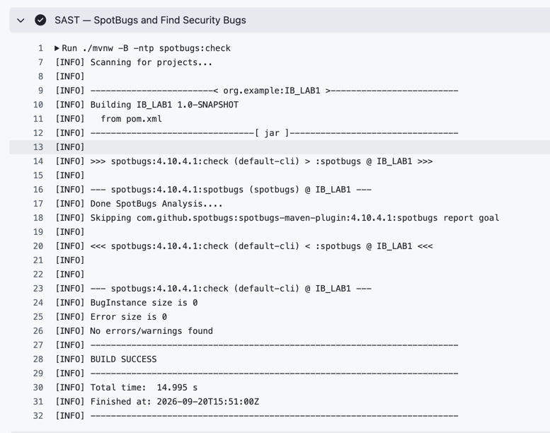
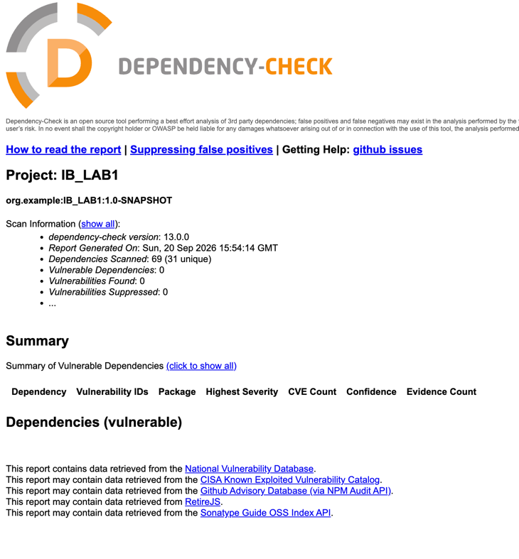

# Лабораторная работа № 1 — Информационная безопасность

Защищённый REST API личных заметок на Java 17 и Spring Boot. База данных — PostgreSQL в Docker. Аутентификация через JWT, пароли хранятся в виде bcrypt-хэшей.

- `POST /auth/login` — вход и получение токена.
- `GET /api/data` — получение своих заметок.
- `POST /api/notes` — создание заметки.

## Запуск

Нужны JDK 17+ и запущенный Docker Desktop. Все команды выполняются из `labs/IB_LAB1`.

В папке проекта должен быть локальный `.env`

```properties
DB_NAME=notes
DB_USER=notes
DB_PORT=5432
DB_PASSWORD=ваш_пароль_базы
APP_USERNAME=student
APP_PASSWORD=ваш_пароль_от_12_символов
JWT_SECRET=случайный_ключ_в_Base64
```

```bash
docker compose up -d --wait
./mvnw spring-boot:run
```

API доступно на `http://localhost:8080`. Для входа используйте `APP_USERNAME` и `APP_PASSWORD`.

## Описание проекта и API

Приложение позволяет пользователю создавать и просматривать личные заметки.
В PostgreSQL хранятся две сущности: пользователь (`app_users`: идентификатор,
логин, хэш пароля) и заметка (`notes`: идентификатор, владелец, заголовок, текст,
время создания). Один пользователь может иметь несколько заметок.

При первом запуске создаётся пользователь из `APP_USERNAME` и `APP_PASSWORD`.
Если такой логин уже есть, его пароль не изменяется. Отдельной регистрации через API нет.


Ниже приведены примеры для Postman. Базовый адрес — `http://localhost:8080`.

### POST /auth/login — вход

Адрес: `http://localhost:8080/auth/login`.
В теле запроса укажите логин и пароль из своего `.env`:

```json
{
  "username": "student",
  "password": "ЗНАЧЕНИЕ_APP_PASSWORD"
}
```


### POST /api/notes — создание заметки

Адрес: `http://localhost:8080/api/notes`. Требуется Bearer-токен. Тело запроса:

```json
{
  "title": "Лабораторная № 1",
  "content": "Проверить защиту API"
}
```

### GET /api/data — получение своих заметок

## Реализованные меры защиты

### Защита от SQL-инъекций (SQLi)

В [UserRepository](src/main/java/org/example/user/UserRepository.java) и
[NoteRepository](src/main/java/org/example/note/NoteRepository.java) запросы
выполняются через `JdbcTemplate` с параметрами `?`. Например, поиск пользователя:

```sql
SELECT id, username, password_hash FROM app_users WHERE username = ?
```

```sql
INSERT INTO app_users (id, username, password_hash) VALUES (?, ?, ?)
```
```sql
INSERT INTO notes (id, owner_id, title, content, created_at) VALUES (?, ?, ?, ?, ?)
```
Значение логина передаётся отдельно от SQL-текста через Prepared Statement.
Таким же образом передаются поля заметки и идентификатор владельца.
Пользовательский ввод не подставляется в SQL конкатенацией строк

### Защита от XSS

В [NoteController](src/main/java/org/example/note/NoteController.java) заголовок и текст заметки экранируются перед отправкой клиенту:

```java
static NoteResponse from(Note note) {
    return new NoteResponse(
            note.id(),
            HtmlUtils.htmlEscape(note.title(), "UTF-8"),
            HtmlUtils.htmlEscape(note.content(), "UTF-8"),
            note.createdAt());
}
```

Метод используется при создании и получении заметок. В БД хранится исходный текст, а в JSON-ответе HTML-символы заменяются сущностями:

```text
Ввод:  <script>alert(1)</script>
Ответ: &lt;script&gt;alert(1)&lt;/script&gt;
```


### Аутентификация

**Хранение паролей.** В [SecurityConfig](src/main/java/org/example/security/SecurityConfig.java) настроен bcrypt со сложностью 12. Перед записью в БД пароль хэшируется со случайной солью:

```java
@Bean
PasswordEncoder passwordEncoder() {
    return new BCryptPasswordEncoder(12);
}
```

```java
users.insert(new AppUser(UUID.randomUUID().toString(), username, encoder.encode(password)));
```

В БД хранится только `password_hash`. 

**Выдача JWT.** В [AuthController](src/main/java/org/example/auth/AuthController.java) после успешной проверки логина и пароля создаётся токен на 3 минуты:

```java
var authenticated = authentication.authenticate(
        UsernamePasswordAuthenticationToken.unauthenticated(request.username(), request.password()));
var now = Instant.now();
var claims = JwtClaimsSet.builder().issuer(SecurityConfig.ISSUER).subject(authenticated.getName())
        .issuedAt(now).expiresAt(now.plusSeconds(180)).build();
var token = encoder.encode(JwtEncoderParameters.from(
        JwsHeader.with(MacAlgorithm.HS256).build(), claims)).getTokenValue();
```

JWT подписывается HS256 с секретом `JWT_SECRET` . В токене находятся логин, издатель и время действия.


В [SecurityConfig](src/main/java/org/example/security/SecurityConfig.java) декодер проверяет подпись HS256, издателя `notes-api`, срок действия и обязательные поля `sub` и `exp`:

```java
var decoder = NimbusJwtDecoder.withSecretKey(key).macAlgorithm(MacAlgorithm.HS256).build();
decoder.setJwtValidator(new DelegatingOAuth2TokenValidator<>(
        JwtValidators.createDefaultWithIssuer(ISSUER),
        jwt -> {
            String subject = jwt.getSubject();
            return jwt.getExpiresAt() != null && subject != null && !subject.isBlank()
                    ? OAuth2TokenValidatorResult.success()
                    : OAuth2TokenValidatorResult.failure(new OAuth2Error("invalid_token"));
        }));
```

Фильтр Spring Security выполняет проверку до вызова защищённых ручек:

```java
.authorizeHttpRequests(auth -> auth
        .requestMatchers(HttpMethod.POST, "/auth/login").permitAll()
        .requestMatchers(HttpMethod.GET, "/api/data").authenticated()
        .requestMatchers(HttpMethod.POST, "/api/notes").authenticated()
        .anyRequest().denyAll())
.oauth2ResourceServer(oauth -> oauth.jwt(Customizer.withDefaults()))
```

Без токена или с недействительным токеном обе ручки заметок возвращают `401`. 

### SAST


### SCA

